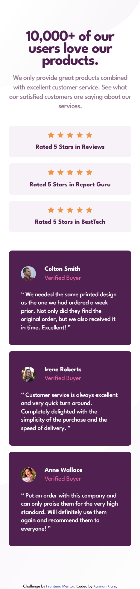

# Frontend Mentor - Social proof section solution

This is a solution to the [Social proof section challenge on Frontend Mentor](https://www.frontendmentor.io/challenges/social-proof-section-6e0qTv_bA).

## Table of contents

- [Frontend Mentor - Social proof section solution](#frontend-mentor---social-proof-section-solution)
  - [Table of contents](#table-of-contents)
  - [Overview](#overview)
    - [The challenge](#the-challenge)
    - [Screenshot](#screenshot)
      - [Desktop](#desktop)
      - [Mobile](#mobile)
    - [Links](#links)
  - [My process](#my-process)
    - [Built with](#built-with)
    - [What I learned](#what-i-learned)
  - [Author](#author)

## Overview

### The challenge

Users should be able to:

- View the optimal layout for the section depending on their device's screen size

### Screenshot

#### Desktop

#### Mobile

### Links

- Solution URL: [Github](https://github.com/kaamiik/fm-Social-Proof-Section)
- Live Site URL: [Vercel](https://fm-social-proof-section-eight.vercel.app/)

## My process

### Built with

- Semantic HTML5 markup
- CSS custom properties
- Flexbox
- CSS Grid
- Mobile-first workflow

### What I learned

- For the **testimonials** and **review** sections, I used the `max-width` property. In the `review__item` section, I removed the left and right `padding` and aligned it using `justify-content: center`. When I use `padding` in **review** section the text start wrapping. so I used flex `justify-content` property.

- In the **customer-feedback** section, because I used negative `margin`, I added that amount to the `padding` in the `main` class to compensate for its effect.

## Author

- Frontend Mentor - [@kaamiik](https://www.frontendmentor.io/profile/kaamiik)
